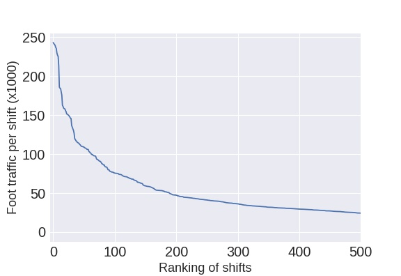

### The task
The WomenTechWomenYes (WTWY) is a non-profit organization devoted to strengthen the role of women in technology. Every year in early summer a funding raising gala is celebrated in New York. The persons attending the event are invited after giving their contact information to street teams working for WTWY. It is essential for this organization to maximize the number of people interacting with the teams but even more important is to optimize the potential donors attending the gala. Exploratory data analysis can be used to predict the best way to employ the teams.    

### The answer from data science
Our data analysis is based in a two steps approach. In a first step data for the entries and exits for each metro station in New York provided by the Municipal Transportation Agency are collected and processed in order to obtain the number of travelers for a given shift. A shift is here defined as the an time interval (morning/afternoon) in week day and for a given metro station. Data for June 2016-2018 are averaged to give an estimation of the travelers for the relevant time interval (June 2019). The shifts are then ordered by foot traffic to find the most important ones (plot below). It can be easily seen that the largest share of the foot traffic is concentrated in the about a hundred shifts. This already pose an upper limit for the maximum number of street teams that will be effective for the task.

In a second step some of the features found to define a person [more likely to donate](https://repository.upenn.edu/wharton_research_scholars/126/) were examined. Based on this a woman with high income working in the tech industry was considered to be a the most likely donor. Data for all three factors were colleted for each zip code in NYC. The proportion of women was extracted from [The Department of Youth and Community Development](https://www1.nyc.gov/site/dycd/index.page). The income was estimated by considering median home prices using [Zillow](https://www.zillow.com/) while the proportion of tech workers were identified using [The 2016 NYC Tech Ecosystem Report](http://abny.org/content.php?page=NYC_Tech_Ecosystem).
Combining these results with the foot traffic a score was calculated using a weighted average and a ranking with the highest density of likely donors for the shifts crystallized.
