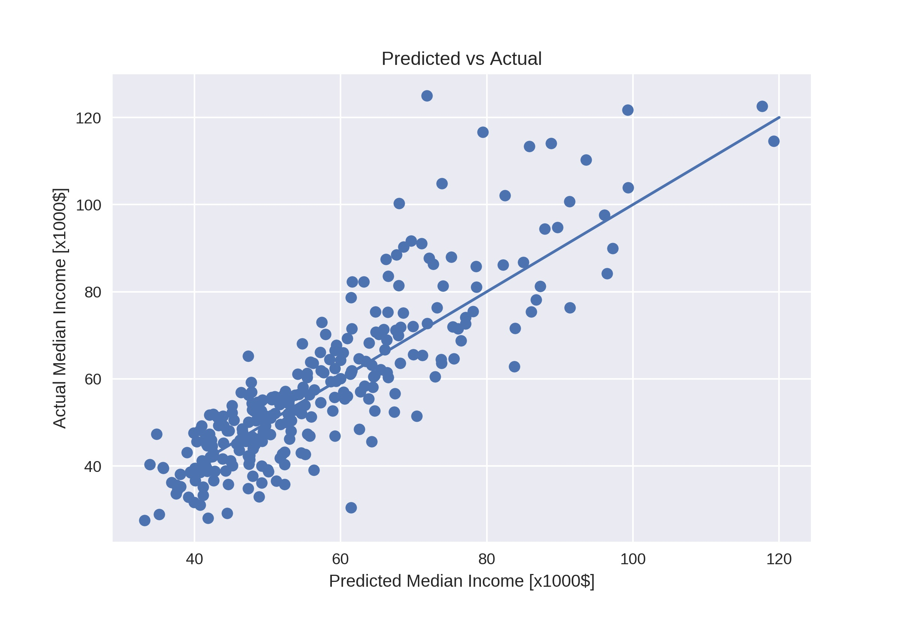

In this project a model is developed to examine the relationship between the influence of some characteristics of a city with the salary of their inhabitants. City governments can use the results to find effective ways to enhance the household incomes of their fellow citizens.

### Examined factors and sources
Our study is restricted to cities larger than 100000 within USA with a number of features considered namely population, land area city, turistical importance of the city, rent prices for appartments and crime rates. Population (estimated July 2017) and land area (as of January 2016) were scrapped from [wikipedia](https://en.wikipedia.org/wiki/List_of_United_States_cities_by_population) being the original source the US Census Bureau. Number of things to do as listed in [https://www.tripadvisor.com/](https://www.tripadvisor.com/) was taken as the quantitative indicator for the touristical importance of each city. Very recent data (June 2018) for the rent appartment prices was scrapped from [www.apartmentlist.com](https://www.apartmentlist.com/). Crime rates for murders and assaults (number per 100000 persons on 2016) as well as the parameter we want to estimate, median income per household, were obtained from [www.city-data.com](http://www.city-data.com/).

### Methodology
The data (272 cities) was divided in train (80%) and test sets (20%). All features were included in polynomials up to degree 3 with regularization using Lasso, Ridge and Elastic Net method. Hyperparameter tuning was carried out using six-fold cross-validation. The median square error for train and test sets were calculated and the former was used as score for choosing the model. The results are sumarized in the table:      

| Method (degree)   | Alpha           | MSE train | MSE test |
|---------          |--------         |     ------|    ------|
| Lasso  (1)        | 0.0179          | 0.321     | 0.398    |
| Lasso  (2)        | 0.0322          | 0.270     | 0.341    |
| Lasso  (3)        | 0.0451          | 0.241     | 0.358    |
| Ridge   (1)       | 19.0            | 0.321     | 0.399    |
| Ridge   (2)       | 44              | 0.275     | 0.366    |
| Ridge   (3)       | 125.7           | 0.267     | 0.538    |
| Elastic net (1)   | 0.02 (l1 =0.89) | 0.321     | 0.399    |
| Elastic net (2)   | 0.03 (l1 =0.99) | 0.268     | 0.338    |
| Elastic net (3)   | 0.05 (l1 =0.89) | 0.241     | 0.359    |

Polynomial of second degree with Elastic net and Lasso validation gave the best results although both where practically the same as the l1 ratio is almost one for elastic net.
Hence a polynomial of second degree with Lasso was chosen as the best model.

### Model and Results
A final linear regression fit with the full data set was carried out.
Comparison between actual and predicted median incomes is shown in the graph:

For this final fit R²=0.726 and a root mean squared error of $9916 was obtained.
Analysis of the polynomial coefficients reveals that a high number of turistical attractions, low crime rates and high rent prices are strongly correlated with high incomes while the city size influences it only in a weakly way.    
